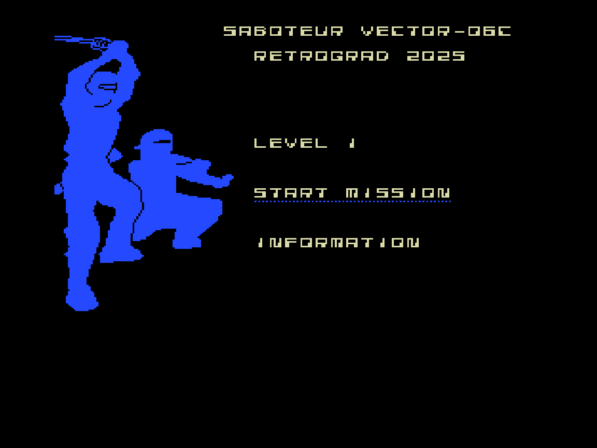
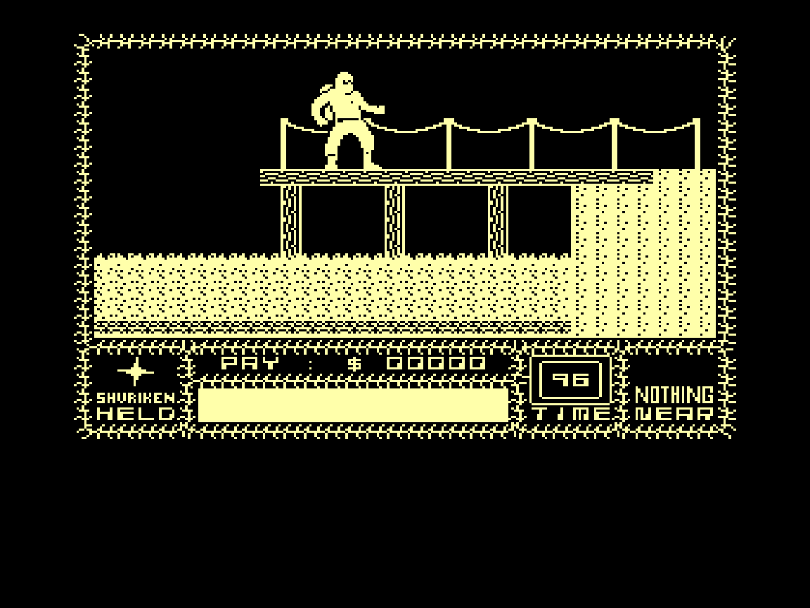

# vector06c-saboteur1
Porting **Saboteur** game to soviet computer [Vector-06c](https://en.wikipedia.org/wiki/Vector-06C) (Вектор-06Ц).

Porting status: Work In Progress.

Screenshot of the ported version:

## Tools for the tools folder

 - `sjasmplus.exe` cross-assembler
   https://github.com/z00m128/sjasmplus

 - `salvador.exe` ZX0 compressor
   https://github.com/emmanuel-marty/salvador/releases
